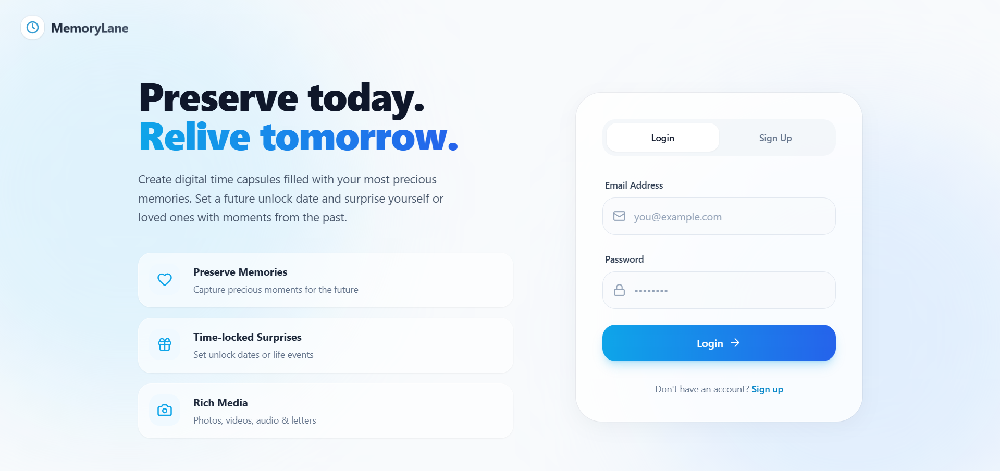
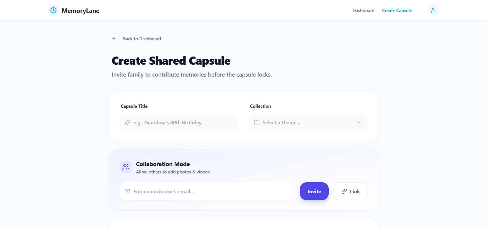
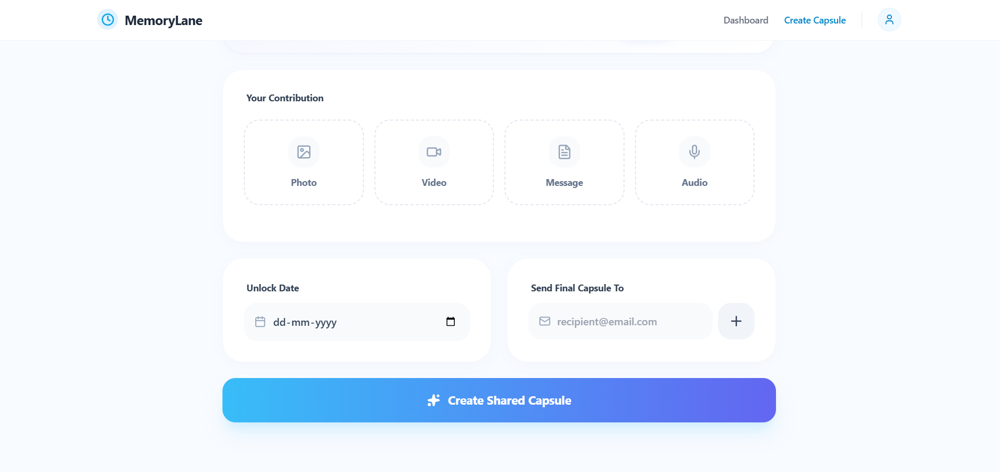
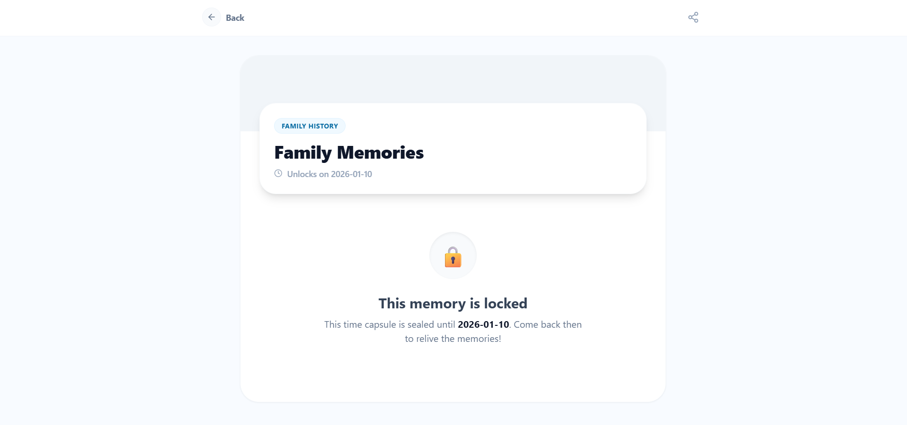
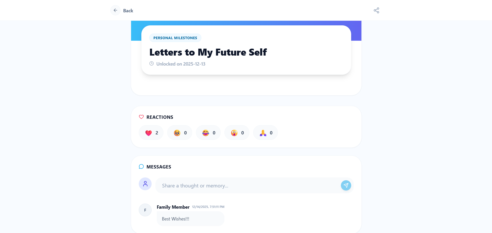
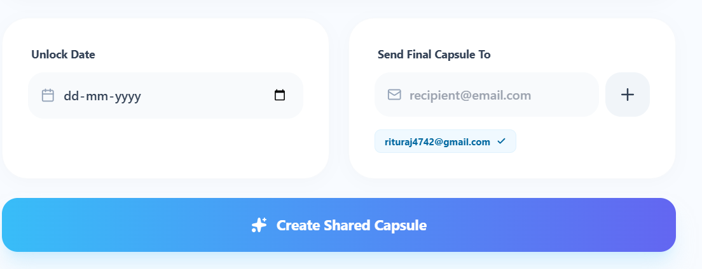
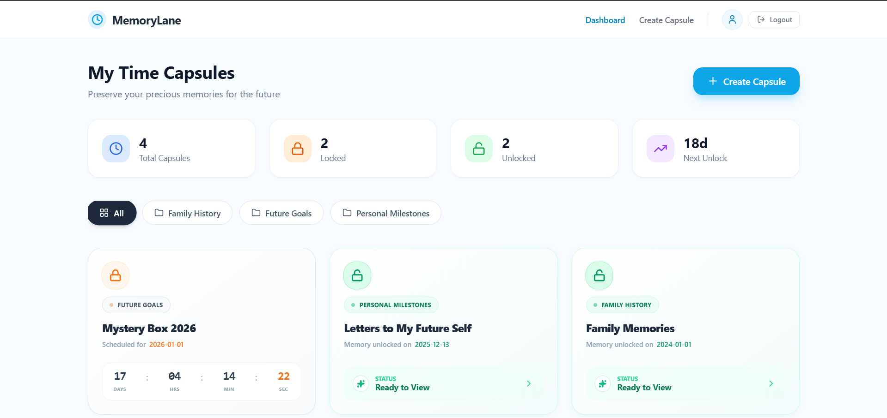
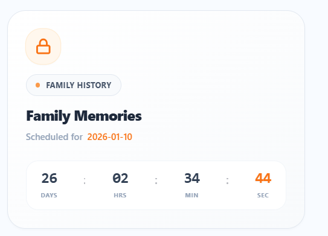
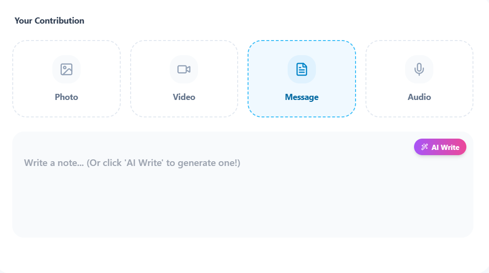
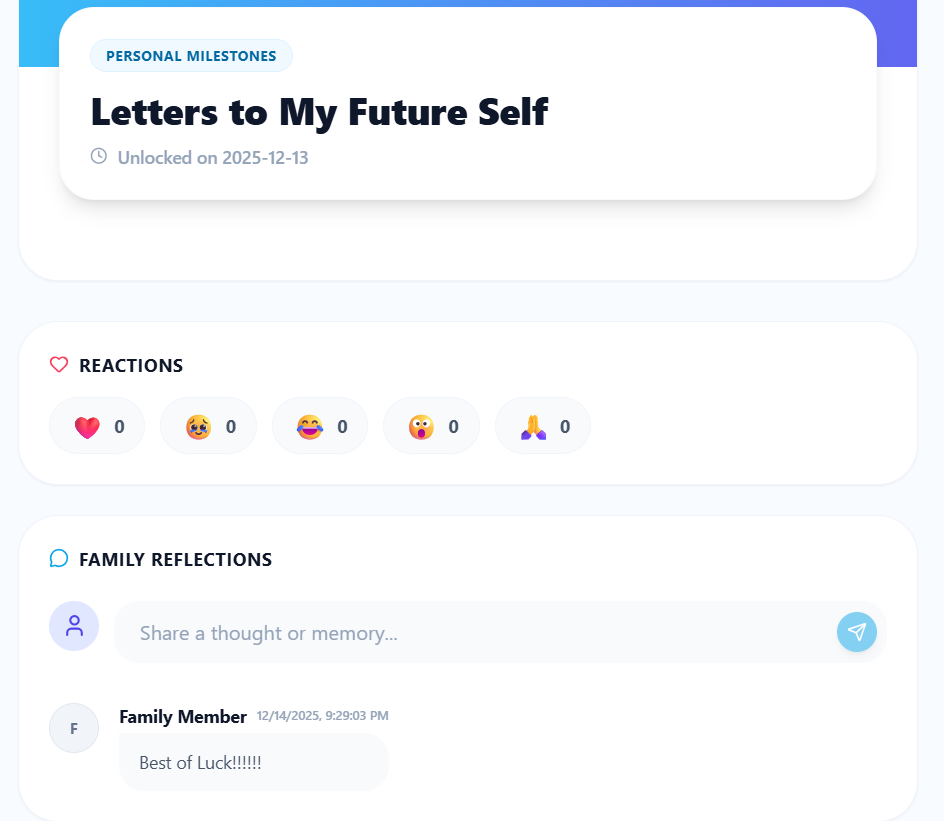

# ⏳ MemoryLane - Digital Time Capsule

**MemoryLane** is a next-generation Digital Time Capsule application designed to preserve memories today so they can be relived tomorrow. Built with a focus on user experience, it combines emotional design with powerful technology to securely lock messages, photos, and videos until a specific future date or life event.

  <h3>
    <a href="https://memorylane01.netlify.app/">🔴 View Live Demo</a>
     | 
    <a href="https://github.com/cipher425/MemoryLane">🐛 Report Bug</a>
  </h3>

 

### 🎥 Project Demo
*Click the image below to watch the full project walkthrough.*

---

## 🛠️ Tech Stack & Architecture

This project leverages modern web technologies to ensure high performance, smooth animations, and AI capabilities.

### **Core Technologies**
* **Frontend Framework:** [React.js](https://react.dev/) (Vite) - For a fast, component-based UI.
* **Styling:** [Tailwind CSS](https://tailwindcss.com/) - For responsive, glassmorphism-inspired design.
* **Animations:** [Framer Motion](https://www.framer.com/motion/) - Powers the cinematic transitions, floating effects, and smooth entry animations.
* **Routing:** React Router DOM - Handles client-side navigation without page reloads.

### **Integrations**
* **🤖 AI Engine:** [Google Gemini API](https://ai.google.dev/) - Generates personalized messages and summaries for capsules.
* **📧 Notifications:** [EmailJS](https://www.emailjs.com/) - Sends real-time email alerts to recipients when capsules unlock.
* **💾 Database:**
    * *Current State:* LocalStorage / IndexedDB (for demo & privacy).
    * *Production Ready:* Configured to easily switch to Firebase/Supabase for cloud storage.
* **Icons:** Lucide React - For consistent, lightweight SVG iconography.

---

## 🌟 Key Features

### ✅ Required Features

**1. Create Digital Time Capsules**
Users can upload text, images, audio, and video to build personalized memory capsules.

| Create View 1 | Create View 2 |
| :---: | :---: |
|  |  |
 

**2. Unlock Conditions**
Allow capsules to unlock on a specific future date or when a life event (graduation, wedding, etc.) is triggered.

| Locked State 🔒 | Unlocked State 🔓 |
| :---: | :---: |
|  |  |
 

**3. Recipient Assignment**
Users can add intended recipients who will receive capsules when they unlock.
 

  

**4. Email Notifications**
Automatically notify recipients via EmailJS when a capsule becomes available. Click the image below to watch the video demo.
 

  

**5. Themed Memory Collections**
Group capsules under themes like “Childhood,” “Family History,” or “College Years” under a dashboard.
 

  

**6. Collaboration Mode**
Enable multiple family members to contribute memories to shared capsules.
 

  

**7. Countdown Timer**
Display remaining time before a capsule unlocks for added anticipation.
 

  

---

### 🚀 Optional / Advanced Features

**1. AI Memory Assistant**
Suggest captions, create summaries, or transcribe old audio files using Google Gemini.
 
*NOTE: Currently The Gemini API key is not working so the feature is not available.*
 

  

**2. Post-Unlock Interaction**
Allow family members to react (❤️, 😂, 🥺), comment, or add reflections to newly unlocked capsules.
 

  

---
---

## 📖 How to Use

1.  **Login/Sign Up:** Enter your details to access your personal dashboard.
2.  **Dashboard:** View your locked (Orange) and unlocked (Green) capsules.
3.  **Create:** Click the "+" button. Add a title, choose a date, write a message, or use AI to generate one. Attach photos/videos.
4.  **Wait:** Watch the countdown timer tick down!
5.  **Unlock:** Once the date arrives, the capsule unlocks. You can now view contents, react, and comment.

---

## 🤝 Contributing

Contributions are welcome! Please fork the repository and create a pull request.

## 📄 License

Distributed under the MIT License.